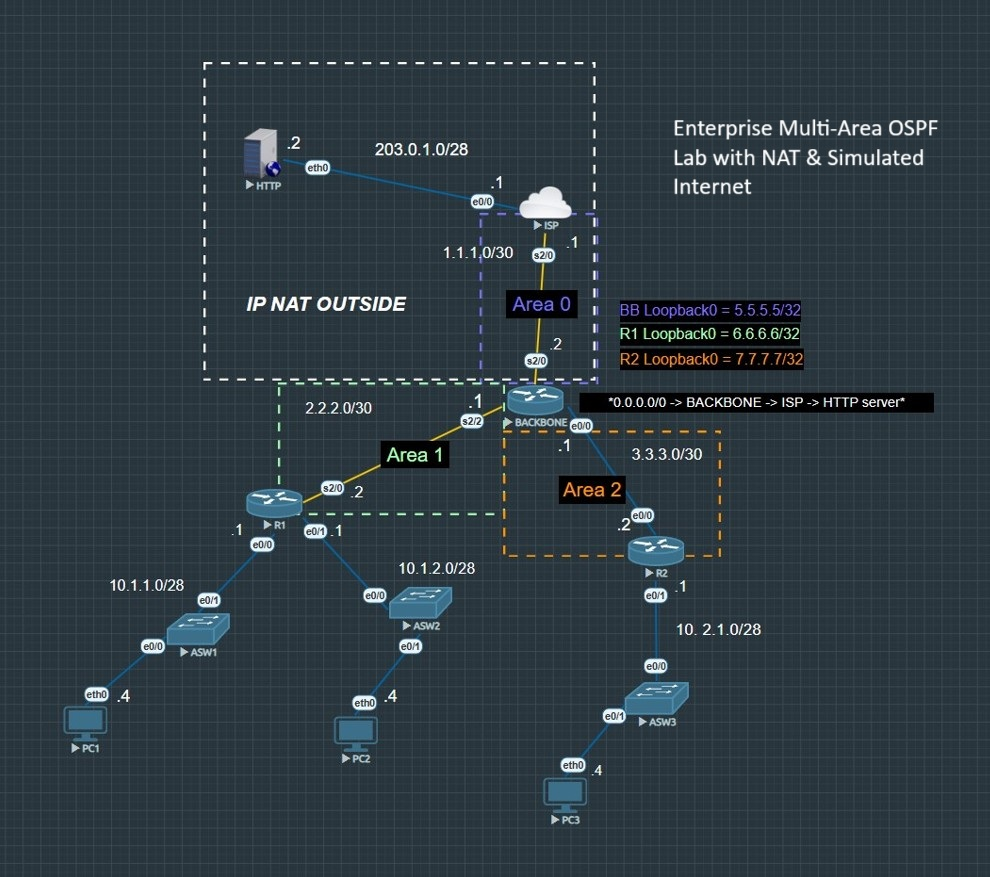

OSPF Routing Lab with NAT/PAT & Simulated Internet Access

This is a routing-focused lab I built in EVE-NG to simulate a small enterprise network. It uses multi-area OSPF, NAT, and includes a simulated ISP and HTTP server to test outbound internet traffic from internal PCs.

The idea was to get hands-on with realistic routing behavior, OSPF design, and edge-NAT scenarios — stuff you’d find in a real enterprise environment, but scaled down into something manageable and repeatable.
---------------------------------------------------------------------------------------------------------
Topology Overview

  - Area 0: The backbone — connects everything together
  - Area 1: A branch site with two access VLANs and PCs
  - Area 2: A remote site with a separate subnet and a third PC
  - ISP: Simulates internet, with an HTTP server sitting in a public /28 block
  - BACKBONE router: Handles NAT and injects the default route into OSPF

The diagram includes loopback interfaces, clearly marked areas, and interface IPs to make the flow easy to follow.

---------------------------------------------------------------------------------------------------------
What’s in the Lab

  - OSPFv2 with 3 areas
  - Default route originated from the backbone router
  - NAT overload (PAT) on BACKBONE for internet-bound traffic
  - Static route on the ISP pointing back to 10.0.0.0/8
  - PCs configured with real IP/gateway settings
  - End-to-end connectivity from internal PCs to a simulated HTTP server
---------------------------------------------------------------------------------------------------------

Addressing Highlights

  - PCs use 10.x.x.x subnets (/28)
  - Point-to-point links use /30s
  - Loopbacks on all routers for consistent router IDs
  - HTTP server sits on 203.0.1.2, with NAT translating internal source IPs to the BACKBONE’s public-facing interface (1.1.1.2)
---------------------------------------------------------------------------------------------------------
Things to Test

  - Ping from any PC to the HTTP server (203.0.1.2)
  - Confirm NAT translations on BACKBONE (show ip nat translations)
  - Check OSPF neighbors and routes (show ip ospf neighbor, show ip route ospf)
  - Try breaking OSPF adjacencies or removing NAT to see the impact
---------------------------------------------------------------------------------------------------------
Tools Used

  - EVE-NG Community Edition
  - Cisco IOSv routers
  - IOSv-L2 switches
  - VPCS for lightweight host simulation
---------------------------------------------------------------------------------------------------------
Notes

I tried to keep the topology realistic without going overboard. There’s room to expand it — maybe add OSPF authentication, stub areas, or simulate a secondary ISP for failover — but for now, this version hits the core learning goals.

The config files for each network device are included in the config folder.

